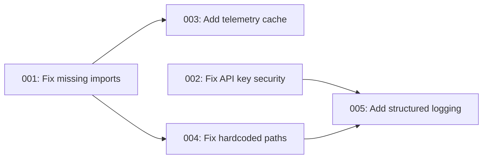

# Advisor Plans — Deep Audit (commit `3f04f14`)

Generated from the deep audit on 2026-07-21. Plans live in `advisor-plans/` because
`plans/` is used for unrelated phase-preparation documents.

## Execution Order & Dependencies

| # | Plan | Finding | Status | Effort | Depends On |
|---|------|---------|--------|--------|------------|
| 001 | [Fix missing urllib/json imports](001-fix-missing-imports.md) | BUG-01 | TODO | S | — |
| 002 | [Fix API key security](002-fix-api-key-security.md) | SEC-01, BUG-03 | TODO | M | — |
| 003 | [Add telemetry cache layer](003-add-telemetry-cache.md) | PERF-01 | TODO | S | 001 |
| 004 | [Fix hardcoded absolute paths](004-fix-hardcoded-paths.md) | TEST-02, SEC-03, DEBT-04 | TODO | S | — |
| 005 | [Replace silent exception swallowing](005-replace-silent-exceptions.md) | SEC-04 | TODO | S | 001, 004 |

### Selected by default (top 5 by leverage = impact ÷ effort)

Plans were auto-selected because no interactive user choice was available.
